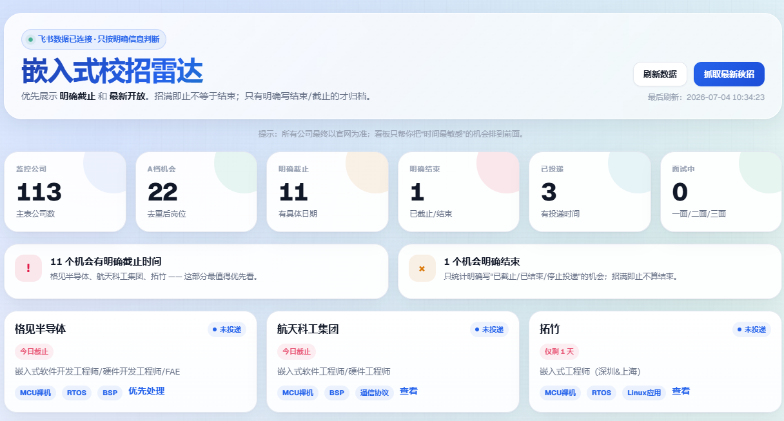

# 嵌入式校招雷达

> 为嵌入式校招同学打造的全自动投递进度看板 + 岗位发现雷达  
> 飞书多维表格 × Python Flask × Playwright × 本地大屏


---

## 这是什么？

**一句话：自动监控你关注的嵌入式公司有没有开校招，发现新岗位就通知你，并在本地大屏上展示你的投递进度。**

秋招季你要同时关注几十家公司的招聘官网，每家什么时候开、开了什么嵌入式岗位、什么时候截止——手动刷网站是人肉雷达，迟早漏。这个工具帮你做自动化：

```
你关注的公司列表（飞书主投递表）
       ↓ 每 4 小时自动扫描
 发现新开放的校招 / 嵌入式岗位 → 写入发现池（飞书机会表）
       ↓ 去重 + 审计 + 同步
 本地看板（localhost:8765）实时展示：进度漏斗、截止时间轴、机会列表
```


## 看板长什么样

> 💡 打开 `http://localhost:8765` 后你会看到以下模块：



### 顶部 KPI 卡片

```
┌──────────┬──────────┬──────────┬──────────┬──────────┬──────────┐
│ 监控公司  │ A档机会  │ 明确截止  │ 明确结束  │ 已投递   │ 面试中   │
│   102    │   15     │    5     │    2     │   14     │    3     │
│ 主表公司  │ 去重后   │ 有具体日期│ 已截止   │ 有投递时间│ 面/二/三面│
└──────────┴──────────┴──────────┴──────────┴──────────┴──────────┘
```

### 告警区

- 🔴 **X 个机会有明确截止时间** — 列出最紧迫的公司名
- 🟠 **X 个机会明确结束** — 只统计明确写"已截止"的，招满即止不算
- 🟢 **暂无紧急截止** — 安全状态

### 优先处理卡片

把"有截止日期 + 还没投"的机会提到最前面，告诉你现在该干嘛。

### 投递漏斗

```
[机会 15] → [已投递 14] → [机考 2] → [面试 3] → [Offer 1]
```

一眼看投递转化健康度。

### 截止时间轴

按日期从近到远排列有明确截止日的公司，含「仅剩 X 天」标签。

### 机会发现池（去重后 A 档）

表格展示去重后的嵌入式岗位：公司 / 岗位名 / 方向 / 地点 / 开放状态 / 投递入口。

### 最新开放 & 已截止

卡片 + 表格双视图。

### 扫描日志

时间 + 检查数 + 新增数 + 耗时，每次扫描自动记录。

### 嵌入式方向分布 / 公司类型分布

柱状图展示你的投递策略是否覆盖面够广。

### 你的投递记录

按投递时间倒序，含公司名、目标岗位、投递时间、面试进度、截止日期。

---

## 系统架构

```
┌─────────────────────────────────────────────────────┐
│                   飞书多维表格                       │
│  ┌─────────────────┐  ┌─────────────────┐          │
│  │  主投递表        │  │  机会发现池      │          │
│  │  (你的投递进度)   │  │  (机器发现的机会) │          │
│  └────────┬────────┘  └────────▲────────┘          │
└───────────┼────────────────────┼───────────────────┘
            │              Feishu OpenAPI
            ▼                    │
┌─────────────────────────────────────────────────────┐
│              Flask 服务 (app.py :8765)               │
│  ┌──────────────────────────────────────────────┐  │
│  │  看板 API (/data)                             │  │
│  │  · KPI 统计  · 投递漏斗  · 方向/类型分布       │  │
│  │  · 机会池数据  · 截止时间轴  · 扫描日志        │  │
│  └──────────────────────────────────────────────┘  │
│  ┌──────────────────────────────────────────────┐  │
│  │  扫描引擎 (do_scan)                            │  │
│  │  · 遍历主表公司 → 请求招聘页面 → 正则匹配      │  │
│  │  · 检测 2027届 校招关键词 + 嵌入式岗位          │  │
│  │  · 写入机会发现池 + 去重 + 同步主表             │  │
│  └──────────────────────────────────────────────┘  │
│  ┌──────────────────────────────────────────────┐  │
│  │  动态抓取 (dynamic_scan_jobs)                  │  │
│  │  · Playwright 渲染 SPA 招聘页                  │  │
│  │  · 提取岗位名 + JD + 投递链接                  │  │
│  └──────────────────────────────────────────────┘  │
└─────────────────────────────────────────────────────┘
            │
            ▼
┌─────────────────────────────────────────────────────┐
│            本地看板 (dashboard.html)                 │
│  浅色主题 · 响应式布局 · 60s 自动刷新 · 手动扫描按钮  │
└─────────────────────────────────────────────────────┘
```

### 核心脚本说明

| 文件 | 作用 |
|---|---|
| `src/app.py` | Flask 主服务：启动扫描 + 每 4h 定时 + 看板 API |
| `src/scan_openings.py` | 静态扫描：读取主表公司 URL → 检测校招关键词 |
| `src/dynamic_scan_jobs.py` | Playwright 动态抓取：渲染大疆/vivo 等 SPA 招聘页 |
| `src/dedupe_utils.py` | 去重引擎：公司/URL/岗位规范化、语义去重、职责句识别 |
| `src/sync_pool_to_main.py` | 机会池 → 主表同步：JD/链接/状态自动回填 |
| `src/sync_apply_url_deadline.py` | 机会池 → 主表同步：投递链接 + 截止时间 + 岗位名 |
| `src/audit_pool.py` | 质量审计：脏数据清理 + 语义去重 + 公司级冗余清理 |
| `src/audit_completeness.py` | 完备性审计：交叉验证池子 A 档与主表字段 |
| `src/dashboard.html` | 大屏看板 HTML 模板（SPA） |
| `src/generate_dashboard.py` | 静态看板生成（旧版，供参考） |

### 辅助脚本

| 文件 | 说明 |
|---|---|
| `src/boss_search.py` | Boss 直聘岗位搜索 |
| `src/validate_data.py` | 数据校验（字段完整度 / 格式 / 一致性） |
| `src/full_sync.py` | 全量同步脚本 |
| `src/fetch_full_jd.py` | 抓取完整 JD 文案 |
| `src/extract_links.py` | 提取页面中的投递/招聘链接 |
| `src/render_pages.py` 等 | 渲染招聘页面 → 本地文本缓存 |
| `src/fix_*.py` | 历史数据修复脚本 |
| `tests/` | 单元测试（去重逻辑 / 同步选择） |

---

## 快速开始

### 前置条件

- Python 3.11+
- 飞书账号（个人版/企业版均可）
- 一个飞书自建应用（权限：多维表格 `bitable:app`）
- 本地 Windows / macOS / Linux

### 第 1 步：复制飞书多维表格模板

> 飞书多维表格模板：[点此打开](https://j0pbq4vb3lh.feishu.cn/wiki/Niv3we4Ldiw56LkEWV2cLuCynvc)
>
> 打开后申请**阅读权限**（我会通过），然后点击右上角「...」→ **复制此表格**到你的飞书空间。
>
> 复制后得到自己的表格链接，格式为 `https://xxx.feishu.cn/base/XXXXXXXXX?table=...`
>
> **记下 `base/` 后面的那串 `XXXXXXXXX`**，这就是 `FEISHU_APP_TOKEN`。

模板包含两张子表：

- **嵌入式秋招主投递表**（24 个字段）— 记录你要投的公司和投递进展
- **机会发现池**（21 个字段）— 自动发现的岗位会写到这里

### 第 2 步：创建飞书自建应用

1. 打开 [飞书开放平台](https://open.feishu.cn/app) → 创建企业自建应用
2. 左侧菜单 → **权限管理** → 搜索「多维表格」→ 开通 `bitable:app`
3. 左侧菜单 → **安全设置** → 添加 IP 白名单（填入本机 IP，或先跳过）
4. 左侧菜单 → **凭证与基础信息** → 复制 **App ID** 和 **App Secret**
5. 左侧菜单 → **版本管理与发布** → 创建版本并**发布**（上线后应用才生效）

> ⚠️ 没发布的应用 API 调不通，这是最常见的卡点。

### 第 3 步：修改 .env 配置

克隆本项目到你本地：

```bash
git clone https://github.com/kaoya-123/embeded_job_rader.git
cd embeded_job_rader
```

将 `.env.example` 复制为 `.env`，填入你的密钥：

```bash
cp .env.example .env
```

`.env` 内容：

```bash
# 飞书应用凭证（从 open.feishu.cn/app 获取）
FEISHU_APP_ID=cli_xxxxxxxx
FEISHU_APP_SECRET=xxxxxxxxxxxxxxxxxxxxxxxxxxxxxxxx

# 多维表格 ID（复制模板后 URL 中的那串）
FEISHU_APP_TOKEN=XXXXXXXXX

# 主投递表 ID（模板自带，复制后通常不变）
MAIN_TABLE_ID=tbldrMY1aJpSH18O

# 机会发现池 ID（模板自带，复制后通常不变）
DISCOVERY_TABLE_ID=tblIsxFVN4yxSLVY
```

> 💡 如果 TABLE_ID 变了，在飞书中点击子表名旁的「...」→ 复制链接，URL 里的 `table=` 后面就是。

### 第 4 步：安装依赖

```bash
pip install -r requirements.txt

# Playwright 浏览器（动态抓取用，首次约 2 分钟）
playwright install chromium
```

### 第 5 步：录入第一批监控公司

打开飞书多维表格 → 进入「嵌入式秋招主投递表」→ 手动录入你想监控的公司。

**至少填写**：公司名称、投递链接。推荐把嵌入式方向、工作地点、意愿也填上。

> 📦 内置 20 家种子公司模板在 `data/seed_companies.json`，可手动对照录入。包含：大疆、华为、蔚来、小鹏、理想、比亚迪、VIVO、OPPO、小米、荣耀、字节跳动、腾讯、百度、博世、禾赛、拓竹、汇川、中兴、海康威视、英伟达。

### 第 6 步：启动看板

```bash
python src/app.py
```

启动后：

```
=== 嵌入式秋招雷达 启动 ===
  看板地址: http://localhost:8765
  定时扫描: 每 4 小时一次（立即执行首次扫描）

  ✅ 主表已有 20 家公司，开始扫描...
[首次扫描] 开始...
  检查 20 条，新增 3 条
```

打开浏览器访问 `http://localhost:8765`，就能看到看板了。

---

## 常用命令

```bash
# 启动看板（含首次扫描）
python src/app.py

# 只预览 UI，跳过首次扫描
python src/app.py --no-initial-scan

# 手动扫描公司招聘页面
python src/scan_openings.py

# 机会池去重审计（只看不删）
python src/audit_pool.py --dry-run

# 机会池去重审计（真实删除）
python src/audit_pool.py

# 同步机会池 → 主表（dry-run）
python src/sync_apply_url_deadline.py --dry-run

# 同步机会池 → 主表（真实写入）
python src/sync_apply_url_deadline.py

# 运行单元测试
python -m unittest discover -s tests
```

---

## 数据流程详解

### 两张核心表的关系

```
机会发现池（机器自动填充）
  · 扫描发现新公司开校招 → 写进去
  · 发现具体嵌入式岗位 → A档；只知公司开放 → B档
  · 可能含重复/脏数据 → 通过 audit_pool 清理
  · 同公司同来源只保留最佳记录 → 语义去重
        ↓ 用户人工确认
 主投递表（你手动维护 + 部分自动同步）
  · 你真实要投的公司
  · 投递链接、截止时间、岗位名从机会池自动同步过来
  · 投递进展、意愿、面试时间 → 你手动填
```

### 扫描逻辑

1. **静态扫描**（`scan_openings.py` / `app.py` 内置）  
   读取主表每家公司的投递链接 → HTTP 请求页面 → 正则匹配 `2027届/校招/提前批` + `嵌入式/BSP/驱动/RTOS/MCU...`  
   → 命中则写入机会发现池

2. **动态抓取**（`dynamic_scan_jobs.py`）  
   适配 SPA 招聘页面（大疆/vivo 等），用 Playwright 渲染 → 提取岗位列表 → 逐条写入机会池

### 去重策略

这是雷达最重要的数据质量层：

- **语义去重**：同公司 + 同发现类型 + 同投递/来源入口 → 只保留评分最高的
- **职责句过滤**：`"4.负责飞控系统各类传感器驱动开发"` 这种是 JD 句子，不能当岗位名
- **公司级冗余清理**：已有「嵌入式岗位开放」记录时，删除低质量「公司校招开放」记录
- **同步安全**：空截止时间不覆盖非空截止时间；`待确认具体岗位` 不覆盖具体岗位名

---

## 飞书表格字段参考

### 主投递表（24 个字段）

| 字段名 | 类型 | 说明 |
|---|---|---|
| 公司名称 | 文本 | 必填 |
| 公司简介 | 文本 | 一句话概括 |
| 公司规模 | 文本 | 如"500-1000人" |
| 工作地点 | 多选 | 北上深杭等 |
| 细分类型 | 多选 | 新势力车企/芯片原厂/IOT 等 |
| 公司/行业类型 | 多选 | 车厂/手机厂/互联网 等 |
| 嵌入式方向 | 多选 | MCU裸机/RTOS/Linux应用/驱动/BSP 等 |
| 岗位类型 | 单选 | 提前批/秋招/春招 |
| 意愿 | 单选 | P0-高意愿/P1-中意愿/P2-低意愿 |
| 投递链接 | URL | 官方招聘入口 |
| 投递截止时间 | 文本 | 如"2026-08-31"或"招满即止" |
| 秋招岗位 | 文本 | 你投的具体岗位名 |
| JD原文 | 文本 | 长文本 |
| 进展 | 多选 | 测评/机考/一面/二面/三面/hr面/OC/已投递/已挂/放弃 |
| 投递时间 | 日期 | |
| 测评时间 | 日期 | |
| 机考时间 | 日期 | |
| 一面/二面/三面 | 日期 | |
| 保温 | 日期 | |
| 结果 | 单选 | OC/挂/放弃/终面结束/拒OFFER |
| 账号密码 | 文本 | 投递账号备忘 |
| 薪资待遇 | 文本 | |

### 机会发现池（21 个字段）

| 字段名 | 类型 | 说明 |
|---|---|---|
| 标题 | 文本 | 自动生成 |
| 疑似公司 | 文本 | 匹配主表的公司名 |
| 岗位名称 | 文本 | 发现的具体岗位 |
| 疑似嵌入式方向 | 多选 | 同主表方向选项 |
| 工作地点 | 多选 | |
| 来源平台 | 单选 | 官网/公众号/牛客/高校就业网 等 |
| 来源链接 | URL | |
| 投递链接 | URL | |
| 命中关键词 | 文本 | |
| 发现时间 | 日期 | |
| 首次发现时间 | 日期 | |
| 最近检测时间 | 日期 | |
| 可信度 | 单选 | 高/中/低 |
| 处理状态 | 单选 | 待确认/已入库/重复/忽略 |
| 岗位开放状态 | 单选 | 已开放/疑似开放/待确认/已截止 |
| JD原文 | 文本 | |
| 发现类型 | 单选 | 公司校招开放/嵌入式岗位开放/JD更新/截止提醒 |
| 是否新增 | 复选框 | |
| 去重Key | 文本 | SHA256，避免重复写入 |
| 发布时间 | 文本 | 如"2026-06-25" |

---

## 目录结构

```
embedded-job-radar/
├── .env.example              # 环境变量模板
├── .gitignore                # Git 排除规则
├── SKILL.md                  # Claude Skill 系统提示词
├── README.md                 # 你正在看这个
├── dashboard.html            # 看板 HTML（项目根备份）
├── requirements.txt          # Python 依赖
├── data/
│   └── seed_companies.json   # 20 家种子公司模板
├── src/
│   ├── app.py                # 主服务入口
│   ├── dashboard.html        # 看板 HTML（SPA）
│   ├── scan_openings.py      # 静态扫描
│   ├── dynamic_scan_jobs.py  # Playwright 动态抓取
│   ├── dedupe_utils.py       # 去重 + 评分引擎
│   ├── audit_pool.py         # 机会池审计
│   ├── audit_completeness.py # 完备性审计
│   ├── sync_pool_to_main.py  # 池→主表同步
│   ├── sync_apply_url_deadline.py  # 链接/截止时间同步
│   ├── generate_dashboard.py # 旧版看板生成
│   ├── full_sync.py          # 全量同步
│   ├── fetch_full_jd.py      # JD 抓取
│   ├── validate_data.py      # 数据校验
│   ├── boss_search.py        # Boss直聘搜索
│   └── ...                   # 其他辅助脚本
└── tests/
    ├── test_dedupe_utils.py  # 去重逻辑测试
    └── test_sync_selection.py # 同步选择测试
```

---

## 常见问题

### Q: 启动后扫描结果为 0？

主表里没有录入公司。扫描是**基于主表的公司列表和投递链接**进行的，空的表什么都扫不到。先手动录入第一批公司（至少填公司名 + 投递链接）。

### Q: 飞书 API 报错 `code != 0`？

检查三件事：
1. `.env` 中的四个密钥是否正确
2. 飞书应用是否已「发布」（版本管理与发布 → 创建版本并发布）
3. 飞书应用是否开通了 `bitable:app` 权限

### Q: Playwright 动态抓取报错？

```bash
playwright install chromium
```

如果已安装但报连接错误，检查网络（部分招聘页面需要代理访问）。

### Q: 为什么机会池有重复？

正常现象。`audit_pool.py` 会在每次扫描后自动运行去重，也可以手动执行 `python src/audit_pool.py`。

### Q: 看板数据不自动更新？

看板每 60 秒自动拉取飞书最新数据。也可以手动点击「刷新数据」按钮。

### Q: 可以监控 2028 届/其他方向吗？

可以。修改 `app.py` 和 `scan_openings.py` 中的正则表达式，把 `2027届|2027|27届` 替换为你的目标届数，「嵌入式」关键词也可以替换为其他技术方向。

### Q: 只有飞书个人版能用吗？

可以。飞书个人版也支持多维表格 API，流程和企业版一样。

---

## 技术栈

| 组件 | 技术 |
|---|---|
| 后端框架 | Flask 3.x |
| 定时调度 | APScheduler 3.x |
| 数据存储 | 飞书多维表格 (Bitable) |
| 动态渲染 | Playwright (Chromium) |
| 前端 | 原生 HTML/CSS/JS，浅色主题 |
| HTTP 客户端 | requests |
| 去重引擎 | 自研：URL/公司规范化 + 语义聚类 + 评分排序 |

---

## 贡献 & 许可

MIT License — 随便用、改、分发。

如果你是非嵌入式方向的同学，这套架构可以直接复用：替换正则匹配规则 + 种子公司列表即可适配任何行业的校招监控。

---

## Star History

[](https://star-history.com/#kaoya-123/embeded_job_rader&Date)

---


## 我是谁

大家好，我是**飞出金陵的烤鸭**，也有同学是从B站、小红书或者公众号认识我的，自认为是非典型工科生，写作已经**四年有余了**。

我是25届应届毕业生，当年秋招拿到了**10+大厂offer**，最终签约大厂。回头看整个秋招过程，我自己也踩过一些坑，但幸运的是，在师兄和一些前辈的帮助下，很多弯路没有走到底。从一开始不知道嵌入式到底该怎么学，到后面准备项目、修改简历、复盘面试、总结八股，再到最终拿到比较满意的结果，这中间其实也经历了一段摸索过程。

也正是因为自己经历过，所以在24年秋招结束之后，我开始陆续分享嵌入式校招相关的经验。到现在已经过去一年多了，这期间我也陆续写了一些文章，录制了一些视频，整理了一些资料和项目。虽然不敢说每一份内容都适合所有人，但我确实希望这些东西能帮准备嵌入式校招的同学少走一点弯路。

目前，我在B站发布了不少**免费的长视频**，大致有**十多个小时**，大家可以在我的B站主页 **“西红柿学长呀”**里看到。这些视频基本都不是碎片内容，而是围绕嵌入式学习和校招准备展开的**系统分享**，内容涵盖**学习路线、项目准备、实习准备、简历写法、面试复盘**等多个方面。[西红柿学长呀的个人空间-西红柿学长呀个人主页-哔哩哔哩视频](https://space.bilibili.com/384121683/lists/4337349?type=season)。

**其中最受欢迎的视频是：【10+大厂offer，我的嵌入式学习路线】** https://www.bilibili.com/video/BV1uoBVYdEem/?share_source=copy_web&vd_source=0b367d13684a1283dae3c0d926f806f6


**当然，如果你有疑惑想和学长交流，也可以找我（备注来意）：**


